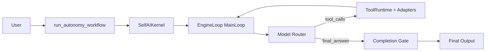
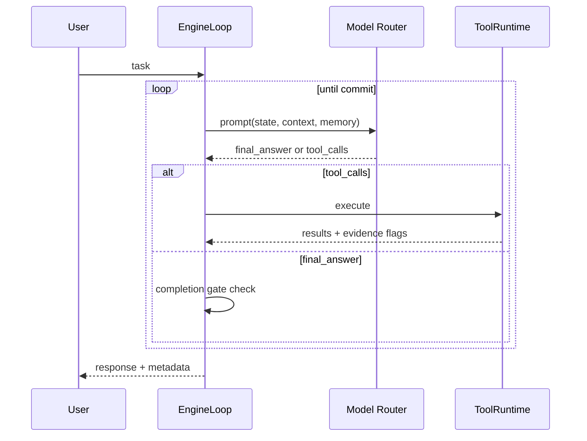

# Self AI

> **Large model capability is all you need.**

Model-first coding agent runtime for real-world engineering tasks.
Self AI lets the model decide what to do, while the system guarantees execution boundaries, tool governance, memory grounding, and traceable outcomes.

This repository excludes large local model assets (`self_ai/model/`) and full local debug logs; it keeps only a curated benchmark evidence subset needed for README metrics.

[Quick Start](#quick-start) · [Architecture](#architecture) · [Benchmarks](#benchmark-highlights) · [Roadmap](#roadmap)

## Why Self AI

- Model-centered MainLoop (`final_answer` vs `tool_calls` each turn)
- Evidence-aware completion gate for safer final commits
- L1/L2/L3 memory pipeline with observable retrieval traces
- Artifact-first eval workflow (`metrics.json` + `report.md` + per-case traces)

## Architecture



## MainLoop in One Response



## Benchmark Highlights

- Public real-eval micro-suite: **72% (18/25)** overall success
- Runtime smoke stability: **100% (5/5)** workflow success
- BFCL structured tool-calling: **schema/function accuracy 100%**, argument exact match **90%**
- HumanEval+ slice: **pass@1 = 100% (5/5)**
- Long memory grounding (mini10 rerun): evidence hit rate **0.3 -> 1.0**, answer accuracy **0.2 -> 0.4**
- SWE-Lite replace-edit slice: patch apply rate **70% (7/10)**

> Benchmark note: these are fixed public mini-subsets and internal reproducible slices, not official leaderboard submissions.

## Quick Start

```powershell
cd self-ai
python -m venv .venv
.\.venv\Scripts\python.exe -m pip install -U pip
.\.venv\Scripts\python.exe -m pip install -e ".[dev,ui]"
copy .env.example .env
# set DASHSCOPE_API_KEY in .env

docker compose up -d
.\.venv\Scripts\python.exe -m streamlit run self_ai/frontend_app.py
```

## Roadmap

- Better long-context factual consistency under compaction stress
- Higher SWE-style end-task resolution beyond patch executability
- Expanded multi-model strategy with stable cost/perf envelopes

## License

MIT
