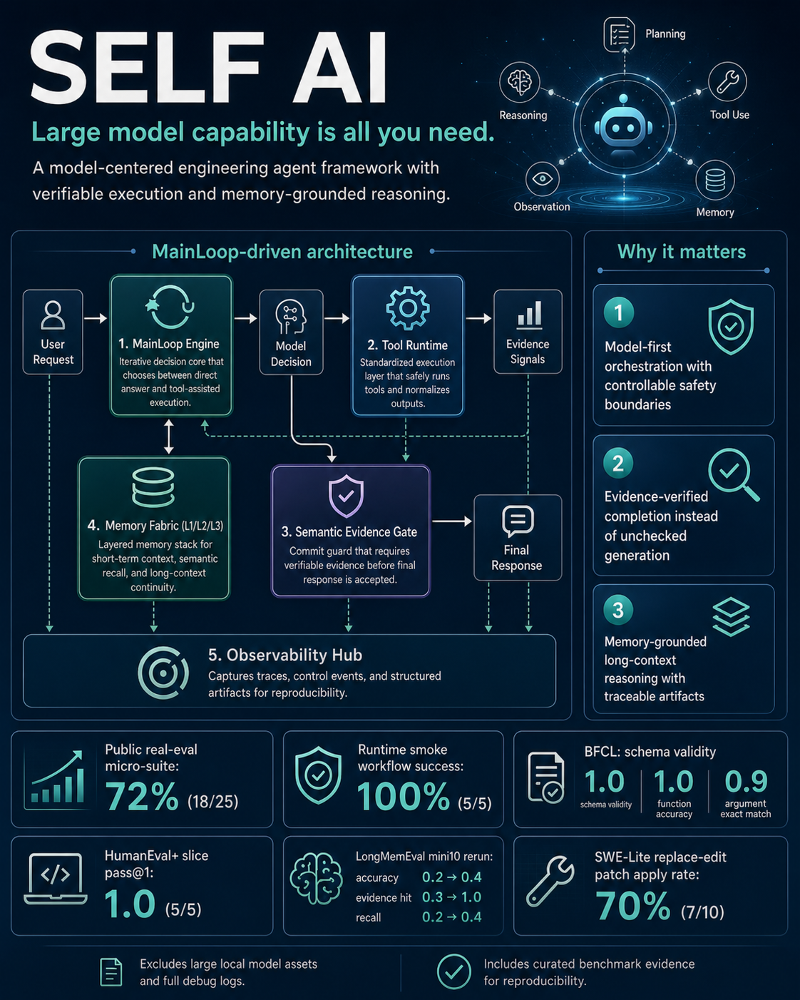
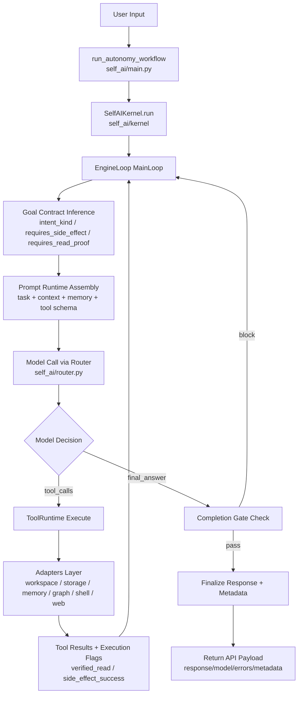
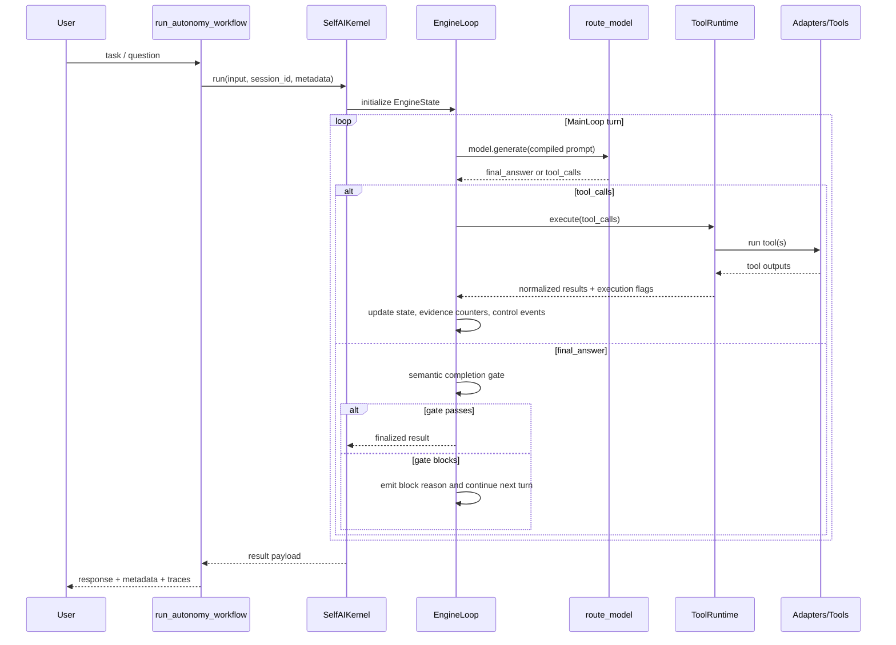
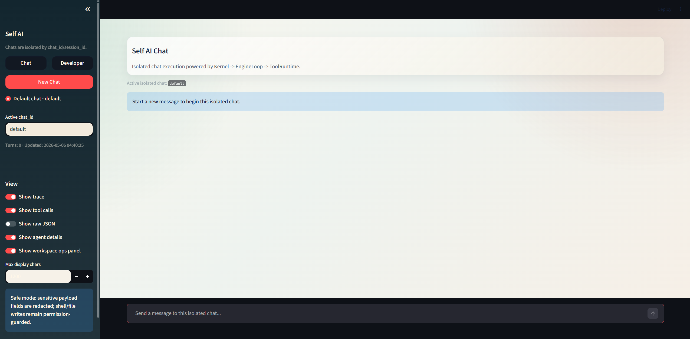

# Self AI

> **Large model capability is all you need.**

Self AI is a model-centered coding agent framework.
The core philosophy is simple: let the model own decision-making, while the system enforces boundaries, permissions, tool execution, and observable failure semantics.



Production path:

`run_autonomy_workflow -> SelfAIKernel.run -> EngineLoop (MainLoop) -> ToolRuntime`

## Repository Scope

This open-source repository intentionally does **not** include:

- Large local model assets under `self_ai/model/`
- Full local runtime logs and debug traces (for example large raw traces outside curated release artifacts)

This repository **does include** a curated benchmark evidence subset used by this README (selected files under `benchmarks/runs/` and `docs/memory_eval_v2/summary/`).

To reproduce full evaluations, prepare your own model assets and run the benchmark scripts locally.

## Why Self AI

- Model-first runtime: MainLoop asks the model to choose between `final_answer` and `tool_calls` every turn.
- Strict execution semantics: state-change tasks require side-effect evidence; read-proof can be explicitly gated.
- Evidence-aware memory stack: L1/L2/L3 memory can be injected and traced.
- Artifact-first evaluation: each benchmark run stores machine-readable metrics and human-readable reports.

## End-to-End Architecture Flow



## MainLoop Sequence (Single Response Lifecycle)



## Capability Snapshot (from Real Run Artifacts)

All metrics below are from local artifacts under `benchmarks/runs` (2026-05-05 to 2026-05-06).

### 1) Execution Reliability

| Metric | Result | Artifact |
|---|---:|---|
| Runtime smoke workflow success | **5/5 (100%)** | `runtime_smoke_batch01_offset0_size5_20260505_1044/metrics.json` |
| Runtime smoke avg latency | 20.628s | same |
| Runtime smoke p95 latency | 28.687s | same |
| Public real-eval completion | **25/25 executed (100%)** | `public_real_eval_25_humaneval_bfcl_simpleqa_20260505_1136/summary.json` |

### 2) Structured Tool-Calling Quality (BFCL)

| Metric | Result | Artifact |
|---|---:|---|
| Schema valid rate | **1.0** | `public_real_eval_25_humaneval_bfcl_simpleqa_20260505_1136/summary.json` |
| Function name accuracy | **1.0** | same |
| Argument exact match | **0.9 (9/10)** | same |
| Task success rate | **0.9 (9/10)** | same |

### 3) Code Ability Slices

| Metric | Result | Artifact |
|---|---:|---|
| HumanEval+ pass@1 (slice) | **1.0 (5/5)** | `public_real_eval_25_humaneval_bfcl_simpleqa_20260505_1136/summary.json` |
| HumanEval+ syntax pass rate | **1.0** | same |
| SWE-Lite replace-edit patch apply rate | **0.7 (7/10)** | `swebench_lite_l1_replace_mini10_summary_20260505_1538/summary.json` |

### 4) Long-Context Memory Grounding

LongMemEval-S mini10 baseline vs rerun (default tier, valid completed runs):

| Metric | Baseline | Rerun | Delta |
|---|---:|---:|---:|
| Answer accuracy | 0.2 | **0.4** | +0.2 |
| Evidence hit rate | 0.3 | **1.0** | +0.7 |
| Memory recall rate | 0.2 | **0.4** | +0.2 |

Sources:
- `longmemeval_s_mini10_summary_20260505_1644/summary.json`
- `longmemeval_s_batch01_offset0_size5_20260506_default3/metrics.json`
- `longmemeval_s_batch02_offset5_size5_20260506_default3/metrics.json`

Self-defined ABCDE memory regression (`docs/memory_eval_v2/summary/metrics.json`):

- L1/L2/L3 all-layer hit rate: **5/5 (100%)**
- Total hits: `L1=52`, `L2=103`, `L3=33`

## Quick Start (Windows PowerShell)

1. Enter project directory.

```powershell
cd self-ai
```

2. Create and prepare virtual environment.

```powershell
python -m venv .venv
.\.venv\Scripts\python.exe -m pip install -U pip
.\.venv\Scripts\python.exe -m pip install -e ".[dev,ui]"
```

3. Configure env.

```powershell
copy .env.example .env
```

Set at least:

- `DASHSCOPE_API_KEY`

Recommended:

- `SELF_AI_PERMISSION_MODE=dev_write`
- `SELF_AI_SHELL_ENABLED=false`

4. Start dependency services.

```powershell
docker compose up -d
docker compose ps
```

5. Start frontend.

```powershell
.\.venv\Scripts\python.exe -m streamlit run self_ai/frontend_app.py
```


## Main Runtime Contracts

- `readonly`: read-only mode.
- `dev_write`: workspace write allowed within project root.
- `dev_full`: optional shell execution, still guarded by allowlist/denylist.

Safety constraints:

- Workspace operations are constrained to `project_root`.
- Path traversal and symlink escape are rejected.
- Completion gate can enforce read/side-effect evidence before final answer commit.

## Project Layout

- `self_ai/main.py`: workflow entrypoint.
- `self_ai/kernel/`: kernel, mainloop, prompt runtime, state store.
- `self_ai/runtime/`: tool runtime, permission guard, registry.
- `self_ai/adapters/`: model/tool/storage/memory adapters.
- `self_ai/memory/`, `self_ai/retrieval/`, `self_ai/graph/`: memory and retrieval subsystems.
- `scripts/`: benchmark runners and validation scripts.
- `benchmarks/`: public subset specs, predictions, run artifacts.
- `tests/`: unit/integration tests.

## Reproducibility and Benchmark Artifacts

Every run writes reproducible artifacts such as:

- `metrics.json`
- `report.md`
- `failures.json` (when available)
- per-case traces under `cases/`

Example command:

```powershell
.\.venv\Scripts\python.exe scripts/light_public_eval_runner.py --stage runtime_smoke
```

## Transparency Notes

- Mini benchmarks are fixed public subsets, not official leaderboard submissions.
- External quota failures (for example `quota_exhausted`) are treated as infrastructure blockers, not model-quality conclusions.
- SWE replace-edit metrics indicate patch executability in this setup, not full official issue-resolution claims.
- Large local model files and full local debug logs are excluded from this repository by design; only curated benchmark evidence needed for README claims is included.

## License

MIT
